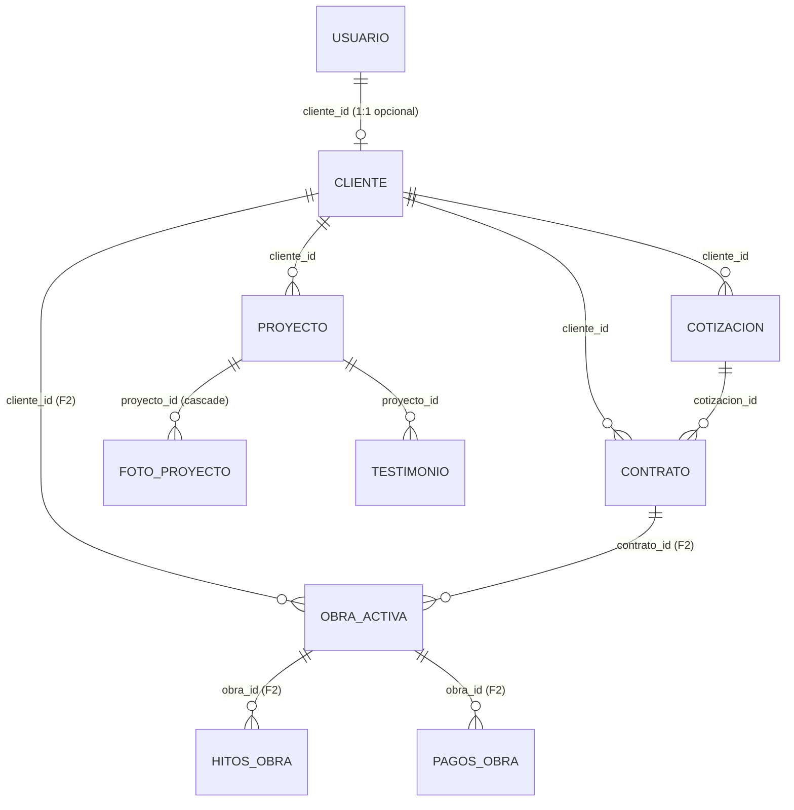

# Base de Datos — Steel Frame Demo

> Esquema Prisma actual (PostgreSQL / Neon) — 18 modelos, 12 enums, 23 relaciones

---

## Enums (12)

| Enum | Valores | Uso |
|------|---------|-----|
| `Rol` | `admin`, `cliente` | `Usuario.rol` |
| `TipoObra` | `vivienda_nueva`, `ampliacion`, `otro` | `Cotizacion.tipoObra` |
| `TipoConstruccion` | `tradicional`, `seco`, `no_sabe`, `integral` | `Cotizacion.tipoConstruccion`, `Proyecto.tipoConstruccion`, `PrecioReferencia.tipoConstruccion`, `ObraActiva` (F2) |
| `RangoM2` | `hasta_50`, `m50_100`, `m100_200`, `mas_200` | `Cotizacion.rangoM2`, `PrecioReferencia.rangoM2` |
| `PlazoInicio` | `lo_antes_posible`, `en_3_meses`, `no_sabe` | `Cotizacion.plazoInicio` |
| `FaseFoto` | `antes`, `durante`, `despues` | `FotoProyecto.fase` |
| `EstadoObra` | `en_curso`, `pausada`, `finalizada`, `entregada` | `ObraActiva.estado` (F2) |
| `EstadoPago` | `registrado`, `confirmado` | `PagoObra.estado` (F2) |

---

## Tablas Fase 1 — Activas en Demo (15)

### 1. `usuarios` (Usuario)

| Campo | Tipo | Constraints | Descripción |
|-------|------|-------------|-------------|
| `id` | `String` | `@id @default(cuid())` | PK |
| `nombre` | `String` | | Nombre completo |
| `email` | `String` | `@unique` | Login único |
| `password_hash` | `String` | `@map("password_hash")` | bcrypt hash |
| `rol` | `Rol` | `@default(cliente)` | admin / cliente (nunca default admin) |
| `cliente_id` | `String?` | `@unique @map("cliente_id")` | FK → `clientes.id` (1:1 opcional) |
| `activo` | `Boolean` | `@default(true)` | Soft enable/disable |
| `creado_en` | `DateTime` | `@default(now()) @map("creado_en")` | Timestamp |

**Relaciones**
- `cliente` → `Cliente` (1:1, opcional, por `cliente_id`)

---

### 2. `clientes` (Cliente)

| Campo | Tipo | Constraints | Descripción |
|-------|------|-------------|-------------|
| `id` | `String` | `@id @default(cuid())` | PK |
| `nombre` | `String` | | Razón social / nombre |
| `whatsapp` | `String` | | Contacto principal |
| `email` | `String?` | `@unique` | Opcional — llave natural de dedupe |
| `ciudad` | `String?` | | Opcional |
| `creado_en` | `DateTime` | `@default(now()) @map("creado_en")` | Timestamp |

**Relaciones**
- `usuario` → `Usuario` (1:1, inverse)
- `cotizaciones` → `Cotizacion[]` (1:N)
- `contratos` → `Contrato[]` (1:N)
- `proyectos` → `Proyecto[]` (1:N)
- `obras` → `ObraActiva[]` (1:N, F2)

---

### 3. `cotizaciones` (Cotizacion)

| Campo | Tipo | Constraints | Descripción |
|-------|------|-------------|-------------|
| `id` | `String` | `@id @default(cuid())` | PK |
| `cliente_id` | `String` | `@map("cliente_id")` | FK → `clientes.id` (obligatorio) |
| `tipo_obra` | `TipoObra` | `@map("tipo_obra")` | Enum |
| `tipo_construccion` | `TipoConstruccion` | `@map("tipo_construccion")` | Enum |
| `rango_m2` | `RangoM2` | `@map("rango_m2")` | Enum |
| `ubicacion_obra` | `String?` | `@map("ubicacion_obra")` | Dirección/ciudad |
| `plazo_inicio` | `PlazoInicio` | `@map("plazo_inicio")` | Enum |
| `origen` | `String` | | `web`, `whatsapp`, `tiktok`, etc. |
| `estado` | `String` | `@default("nuevo")` | Funnel: `nuevo`→`contactado`→`visita_tecnica`→`presupuestado`→`ganado`/`perdido` |
| `monto_estimado` | `Decimal?` | `@db.Decimal(12,2) @map("monto_estimado")` | Estimación inicial |
| `monto_cerrado` | `Decimal?` | `@db.Decimal(12,2) @map("monto_cerrado")` | Valor final acordado |
| `notas_internas` | `String?` | `@map("notas_internas")` | Solo admin |
| `requerimiento` | `String?` | `@map("requerimiento")` | Mensaje del cliente del form público |
| `creado_en` | `DateTime` | `@default(now()) @map("creado_en")` | |
| `actualizado_en` | `DateTime` | `@updatedAt @map("actualizado_en")` | Auto-update |

**Índices**: `cliente_id`, `origen`, `estado`

**Relaciones**
- `cliente` → `Cliente` (N:1)
- `contratos` → `Contrato[]` (1:N)

---

### 4. `contratos` (Contrato)

| Campo | Tipo | Constraints | Descripción |
|-------|------|-------------|-------------|
| `id` | `String` | `@id @default(cuid())` | PK |
| `cliente_id` | `String` | `@map("cliente_id")` | FK → `clientes.id` |
| `cotizacion_id` | `String?` | `@map("cotizacion_id")` | FK → `cotizaciones.id` (opcional) |
| `archivo_pdf_url` | `String?` | `@map("archivo_pdf_url")` | Link a PDF firmado |
| `fecha_firma` | `DateTime?` | `@map("fecha_firma")` | |
| `monto_total` | `Decimal` | `@db.Decimal(12,2) @map("monto_total")` | Valor contractual |
| `observaciones` | `String?` | | |
| `creado_en` | `DateTime` | `@default(now()) @map("creado_en")` | Registro cargado en sistema |

**Relaciones**
- `cliente` → `Cliente` (N:1)
- `cotizacion` → `Cotizacion` (N:1, opcional)
- `obras` → `ObraActiva[]` (1:N, F2)

---

### 5. `proyectos` (Proyecto)

| Campo | Tipo | Constraints | Descripción |
|-------|------|-------------|-------------|
| `id` | `String` | `@id @default(cuid())` | PK |
| `cliente_id` | `String?` | `@map("cliente_id")` | FK → `clientes.id` |
| `slug` | `String` | `@unique` | URL amigable |
| `titulo` | `String` | | Nombre del proyecto |
| `tipo_construccion` | `TipoConstruccion` | `@map("tipo_construccion")` | Enum |
| `m2_construidos` | `Int` | `@map("m2_construidos")` | Metraje |
| `dias_ejecucion` | `Int` | `@map("dias_ejecucion")` | Plazo real |
| `ubicacion` | `String` | | Ciudad/barrio |
| `problema_cliente` | `String` | `@map("problema_cliente")` | Pain point |
| `solucion` | `String` | | Qué hicimos |
| `destacado` | `Boolean` | `@default(false)` | Hero/carrusel |
| `publicado` | `Boolean` | `@default(false)` | Visible en web |
| `creado_en` | `DateTime` | `@default(now()) @map("creado_en")` | |
| `actualizado_en` | `DateTime` | `@updatedAt @map("actualizado_en")` | |

**Relaciones**
- `cliente` → `Cliente` (N:1)
- `fotos` → `FotoProyecto[]` (1:N, cascade delete)
- `testimonios` → `Testimonio[]` (1:N)

---

### 6. `fotos_proyecto` (FotoProyecto)

| Campo | Tipo | Constraints | Descripción |
|-------|------|-------------|-------------|
| `id` | `String` | `@id @default(cuid())` | PK |
| `proyecto_id` | `String` | `@map("proyecto_id")` | FK → `proyectos.id` |
| `url` | `String` | | Ruta en `/public/img/` o storage |
| `fase` | `FaseFoto` | | `antes` / `durante` / `despues` |
| `orden` | `Int` | | Orden en galería |

**Índice**: `proyecto_id`

**Relaciones**
- `proyecto` → `Proyecto` (N:1, onDelete: Cascade)

---

### 7. `testimonios` (Testimonio)

| Campo | Tipo | Constraints | Descripción |
|-------|------|-------------|-------------|
| `id` | `String` | `@id @default(cuid())` | PK |
| `proyecto_id` | `String?` | `@map("proyecto_id")` | FK → `proyectos.id` (opcional) |
| `cliente_nombre` | `String` | `@map("cliente_nombre")` | Nombre visible |
| `texto` | `String` | | Testimonio |
| `foto_url` | `String?` | `@map("foto_url")` | Foto cliente/obra |
| `puntaje` | `Int?` | | 1-5 estrellas |
| `autoriza_publicar` | `Boolean` | `@default(false) @map("autoriza_publicar")` | Consentimiento |
| `publicado` | `Boolean` | `@default(false)` | Visible en web |
| `creado_en` | `DateTime` | `@default(now()) @map("creado_en")` | |
| `actualizado_en` | `DateTime` | `@updatedAt @map("actualizado_en")` | |

**Índice**: `proyecto_id`

**Relaciones**
- `proyecto` → `Proyecto` (N:1, opcional)

---

### 8. `servicios` (Servicio)

| Campo | Tipo | Constraints | Descripción |
|-------|------|-------------|-------------|
| `id` | `String` | `@id @default(cuid())` | PK |
| `slug` | `String` | `@unique` | URL: `/servicios/[slug]` |
| `titulo` | `String` | | Nombre |
| `descripcion` | `String` | | Detalle |
| `orden` | `Int` | `@default(0)` | Orden en grid |
| `activo` | `Boolean` | `@default(true)` | Visible en web |

---

### 9. `faqs` (Faq)

| Campo | Tipo | Constraints | Descripción |
|-------|------|-------------|-------------|
| `id` | `String` | `@id @default(cuid())` | PK |
| `pregunta` | `String` | | |
| `respuesta` | `String` | | |
| `orden` | `Int` | `@default(0)` | Orden en lista |
| `activo` | `Boolean` | `@default(true)` | Visible en web |

---

### 10. `certificaciones` (Certificacion)

| Campo | Tipo | Constraints | Descripción |
|-------|------|-------------|-------------|
| `id` | `String` | `@id @default(cuid())` | PK |
| `titulo` | `String` | | Nombre certificado |
| `descripcion` | `String` | | Detalle |
| `activo` | `Boolean` | `@default(true)` | Visible en web |

---

### 11. `precio_referencia` (PrecioReferencia)

| Campo | Tipo | Constraints | Descripción |
|-------|------|-------------|-------------|
| `id` | `String` | `@id @default(cuid())` | PK |
| `tipo_construccion` | `TipoConstruccion` | `@map("tipo_construccion")` | Enum |
| `rango_m2` | `RangoM2` | `@map("rango_m2")` | Enum |
| `precio_min` | `Decimal` | `@db.Decimal(12,2) @map("precio_min")` | Mínimo por m² |
| `precio_max` | `Decimal` | `@db.Decimal(12,2) @map("precio_max")` | Máximo por m² |
| `vigente_desde` | `DateTime` | `@default(now()) @map("vigente_desde")` | Historial de precios |

**Único compuesto**: `(tipo_construccion, rango_m2, vigente_desde)`

---

### 12. `account` (NextAuth)

| Campo | Tipo | Constraints |
|-------|------|-------------|
| `id` | `String` | `@id @default(cuid())` |
| `user_id` | `String` | `@map("user_id")` |
| `type` | `String` | |
| `provider` | `String` | |
| `provider_account_id` | `String` | `@map("provider_account_id")` |
| ... | | (campos estándar NextAuth) |

**Único compuesto**: `(provider, provider_account_id)`

---

### 13. `session` (NextAuth)

| Campo | Tipo | Constraints |
|-------|------|-------------|
| `id` | `String` | `@id @default(cuid())` |
| `session_token` | `String` | `@unique @map("session_token")` |
| `user_id` | `String` | `@map("user_id")` |
| `expires` | `DateTime` | |

---

### 14. `verification_token` (NextAuth)

| Campo | Tipo | Constraints |
|-------|------|-------------|
| `identifier` | `String` | |
| `token` | `String` | `@unique` |
| `expires` | `DateTime` | |

**Único compuesto**: `(identifier, token)`

---

### 15. `authenticator` (NextAuth / WebAuthn)

| Campo | Tipo | Constraints |
|-------|------|-------------|
| `credential_id` | `String` | `@unique @map("credential_id")` |
| `user_id` | `String` | `@map("user_id")` |
| ... | | (campos estándar WebAuthn) |

---

## Tablas Fase 2 — Implementadas (3)

> Módulos de obra activa: portal de cliente y panel admin ya los usan.

### 16. `obras_activas` (ObraActiva)

| Campo | Tipo | Descripción |
|-------|------|-------------|
| `id` | `String` | PK |
| `cliente_id` | `String` | FK → `clientes` |
| `contrato_id` | `String?` | FK → `contratos` |
| `direccion_obra` | `String` | |
| `fecha_inicio` | `DateTime` | |
| `fecha_fin_estimada` | `DateTime?` | |
| `estado` | `EstadoObra` | Enum F2 |
| `progreso` | `Int` | 0-100% |

**Índices**: `cliente_id`, `contrato_id`

**Relaciones**: `cliente`, `contrato`, `hitos[]`, `pagos[]`

---

### 17. `hitos_obra` (HitosObra)

| Campo | Tipo | Descripción |
|-------|------|-------------|
| `id` | `String` | PK |
| `obra_id` | `String` | FK → `obras_activas` |
| `titulo` | `String` | Nombre del hito |
| `descripcion` | `String` | |
| `fecha` | `DateTime` | |
| `foto_url` | `String?` | Evidencia |
| `visible_cliente` | `Boolean` | `@default(false)` |

**Índice**: `obra_id`

---

### 18. `pagos_obra` (PagoObra)

| Campo | Tipo | Descripción |
|-------|------|-------------|
| `id` | `String` | PK |
| `obra_id` | `String` | FK → `obras_activas` |
| `monto` | `Decimal` | `@db.Decimal(12,2)` |
| `fecha` | `DateTime` | |
| `concepto` | `String` | Descripción |
| `comprobante_url` | `String?` | PDF/imagen |
| `estado` | `EstadoPago` | Enum F2 |

**Índice**: `obra_id`

---

## Diagrama de Relaciones (Mermaid)

---

## Notas de Implementación

- **Nomenclatura**: `snake_case` en BD (`@map`), `camelCase` en código Prisma
- **IDs**: `cuid()` (cortos, URL-safe, ordenables)
- **Timestamps**: `creado_en` (default now), `actualizado_en` (@updatedAt)
- **Soft delete**: `activo` / `publicado` booleans, no hard delete
- **Decimal money**: `@db.Decimal(12,2)` para ARS
- **NextAuth**: Sesiones JWT sobre `usuarios`. Nota: `@auth/prisma-adapter` está configurado en código pero las tablas del adapter (`account`, `session`, `verification_token`, `authenticator`) NO existen en el schema; con strategy JWT + Credentials no se usan, pero el adapter está de más (ver decisión pendiente).
- **Fase 2**: Modelos `ObraActiva`, `HitosObra`, `PagoObra` implementados (portal cliente + panel admin).